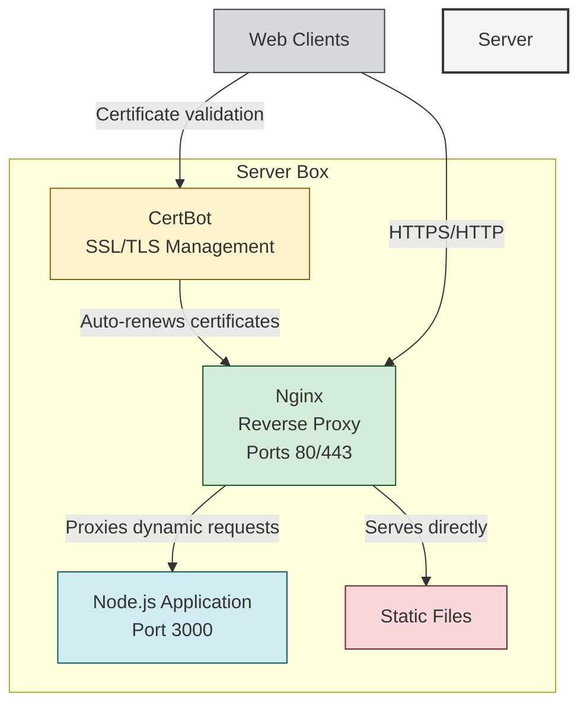

# TAGA Deployment Documentation

## Server Architecture Diagram



## Components

### Nginx
- **Role**: Reverse proxy and web server
- **Ports**: Listens on 80 (HTTP) and 443 (HTTPS)
- **Functions**:
  - Terminates SSL/TLS connections
  - Serves static assets directly
  - Proxies API and dynamic requests to Node.js
  - Load balancing (if multiple Node instances)
  - Rate limiting and security headers

### CertBot (Let's Encrypt)
- **Role**: Automated SSL certificate management
- **Functions**:
  - Obtains free TLS certificates
  - Auto‑renews certificates before expiry
  - Updates Nginx configuration automatically
  - Supports wildcard certificates if needed

### Node.js Application
- **Role**: Main web application server
- **Port**: Typically runs on 3000 (or other non‑privileged port)
- **Functions**:
  - Handles business logic and API endpoints
  - Renders dynamic pages
  - Connects to databases and external services

## Deployment Commands

The following aliases are available for managing the deployment:

```
sshtagaadmin='ssh admin-taga@31.97.62.187'
sshtagadev='ssh dev-taga@31.97.62.187'
sshtagasys='ssh sys-taga@31.97.62.187'
taga-admin='ssh admin-taga@taga-prod'
taga-cloudflare='firefox -P "ravi" https://dash.cloudflare.com &'
taga-dev='ssh dev@taga-prod'
taga-domain='firefox -P "ravi" https://www.godaddy.com &'
taga-github='firefox -P "ravi" https://www.github.com/nammataga &'
taga-host='firefox -P "ravi" https://hpanel.hostinger.com/vps/992688/overview &'
taga-info='cat secret | grep taga'
taga-root='ssh root@taga-prod'
taga-sys='ssh sys-taga@taga-prod'
taga-vm='ssh ravi@vm-taga'
tagaApi='cd ~/code/github/nammataga/prod/taga-api'
tagaUi='cd ~/code/github/nammataga/prod/taga-ui'
```

## Typical Deployment Flow

1. **Code Deployment**:
   ```bash
   git pull origin main
   npm install
   npm run build
   ```

2. **Process Management** (using PM2):
   ```bash
   pm2 restart app-name
   ```

3. **Nginx Configuration**:
   - Located at `/etc/nginx/sites-available/`
   - Test with `sudo nginx -t`
   - Reload with `sudo systemctl reload nginx`

4. **SSL Certificate Renewal**:
   ```bash
   sudo certbot renew --dry-run
   sudo certbot renew
   ```

## Monitoring

- Check Nginx status: `sudo systemctl status nginx`
- Check Node.js process: `pm2 status`
- View logs: `pm2 logs` or `sudo journalctl -u nginx`
